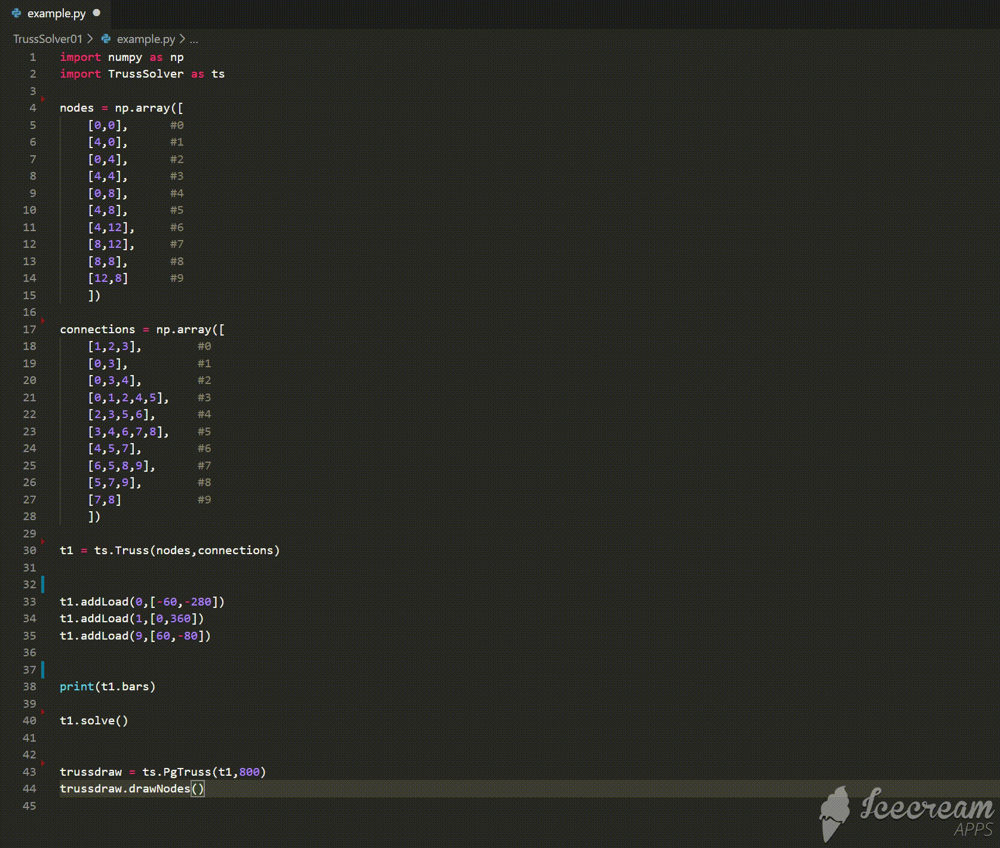

# Truss Solver
Python script that solves simple 2D truss structures 
## Requirements
Numpy
```bash
pip install numpy
```
PyGame
```bash
pip install pygame
```
## Usage

```python
import TrussSolver as ts
import numpy as np
```
The **nodes** array stores the coordinates [x, y] of each node. 
The order of the nodes in this array will determine the numbering of nodes

```python
nodes = np.array([    
    [0,0],      #0
    [4,0],      #1
    [0,4],      #2
    [4,4],      #3
    [0,8],      #4
    [4,8],      #5
    [4,12],     #6
    [8,12],     #7
    [8,8],      #8
    [12,8]      #9
    ])
```
The **connections** array stores the nodes connected to each node.
So for example, in this case node 0 is conected to nodes 1, 2 and 3.
```python
connections = np.array([
    [1,2,3],        #0
    [0,3],          #1
    [0,3,4],        #2
    [0,1,2,4,5],    #3
    [2,3,5,6],      #4
    [3,4,6,7,8],    #5
    [4,5,7],        #6
    [6,5,8,9],      #7
    [5,7,9],        #8
    [7,8]           #9
    ])
```
The **Truss** class is used to create a new truss with two numpy arrays as inputs:
nodes and connections

```python
t1 = ts.Truss(nodes,connections)
```
Add external loads to the nodes with the **addLoad** method.

```python
t1.addLoad(0,[-60,-280])
t1.addLoad(1,[0,360])
t1.addLoad(9,[60,-80])
```
The **solve** method exectues the calculations with the given truss configuration.
The output is an array of the forces at each member of the truss. This array follows the
order of the <bars> array.

```python
t1.solve()
```

Once the truss has been solved the **PgTruss** class allows to draw it using pygame.
The initialitation of the class takes 2 arguments:
- The truss object that is going to be drawn
- The width resolution in pixels of the output screen

The **drawNodes** method is called to draw the whole truss and the results.
- Blue: Compression
- Red: Tension
    
```python
trussdraw = ts.PgTruss(t1,800)
trussdraw.drawNodes()

```


